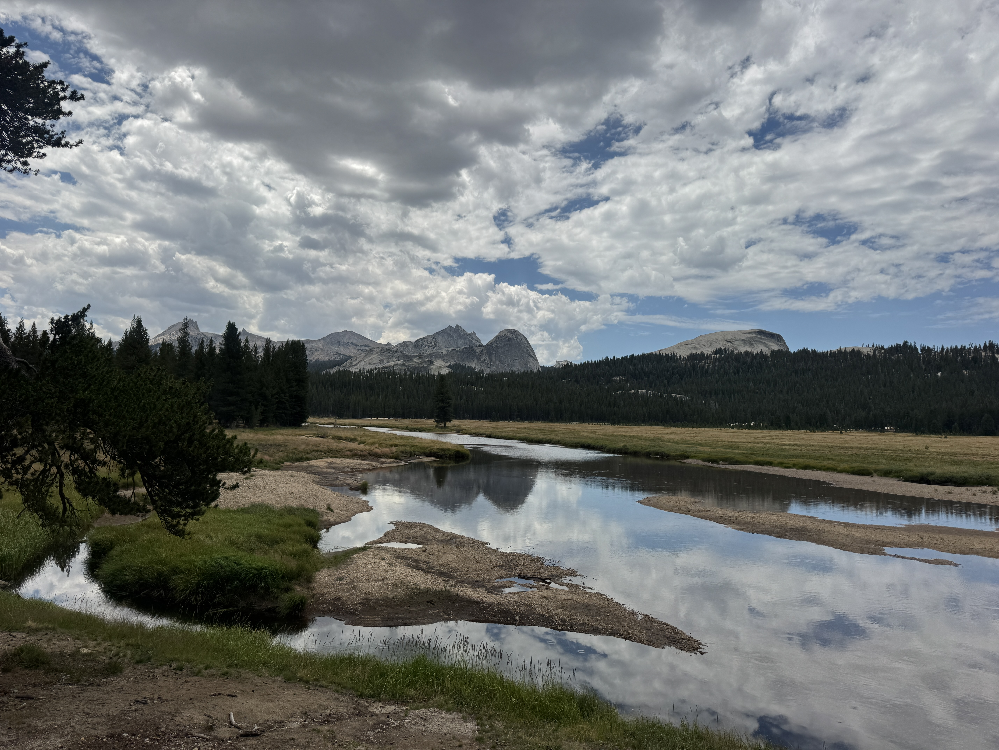
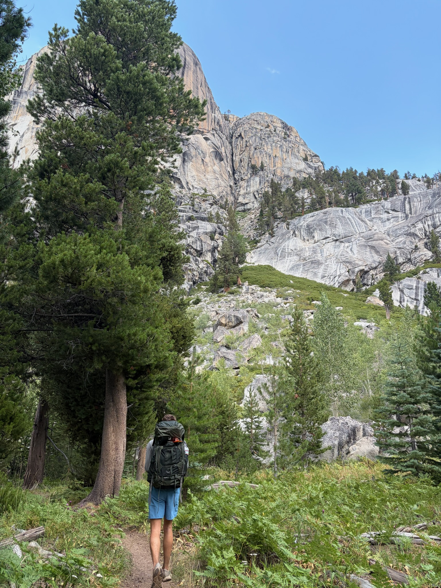
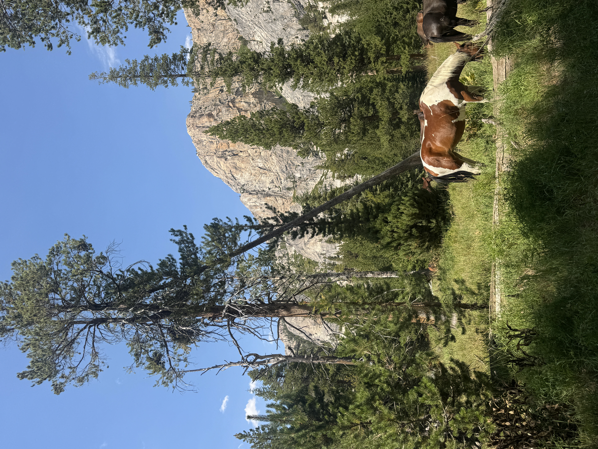
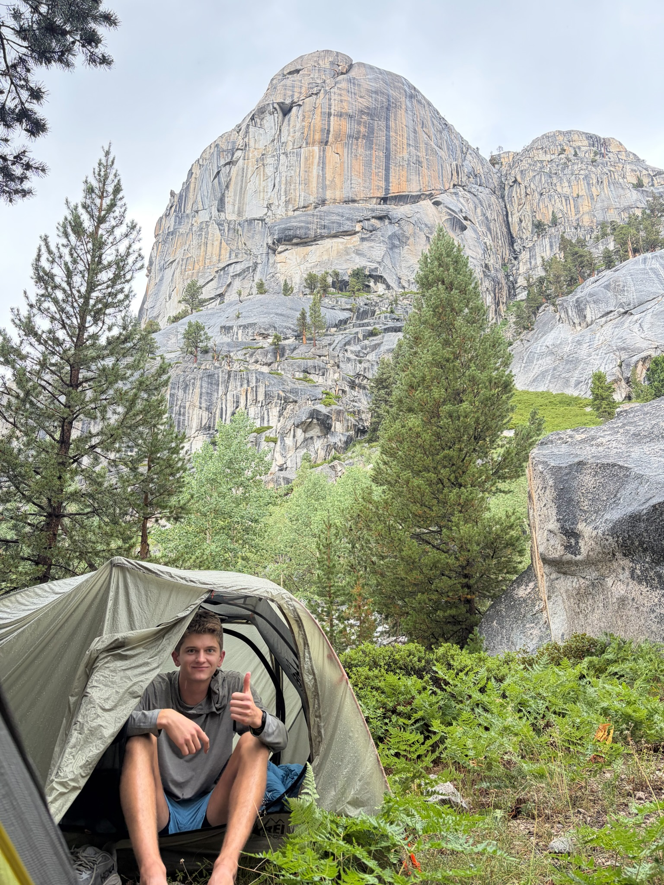
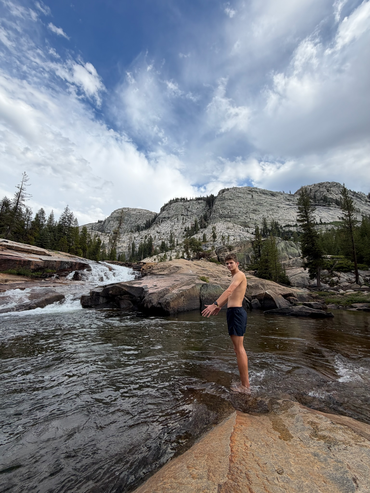
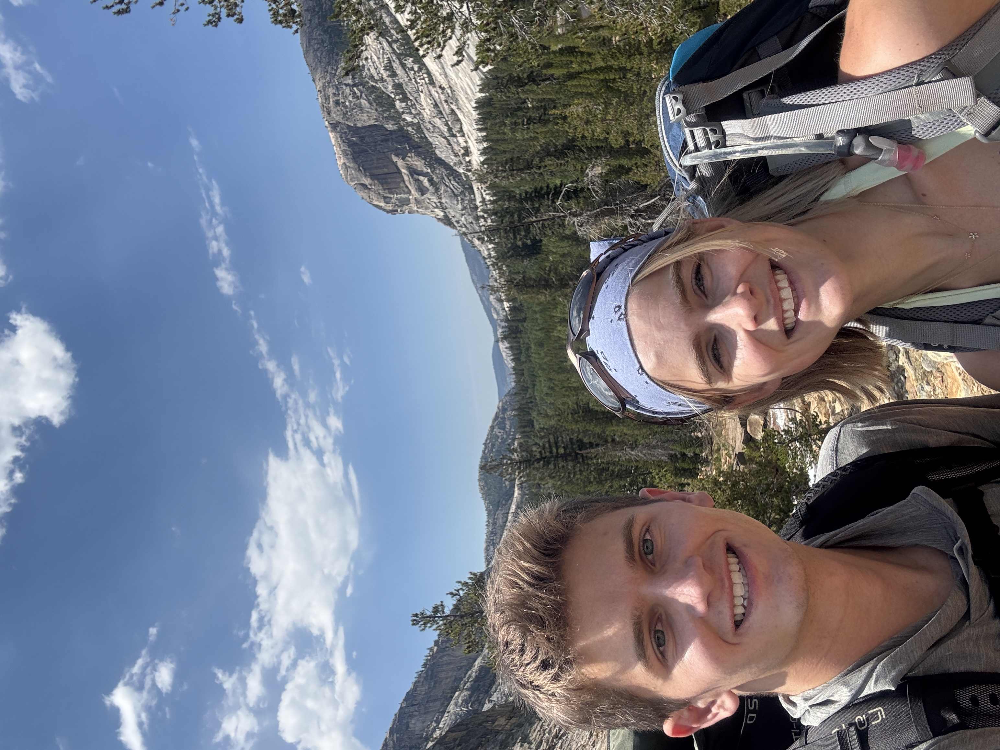
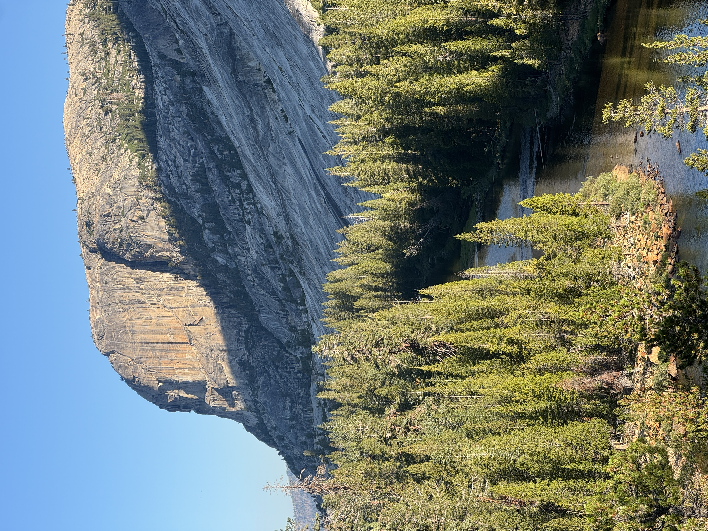

---
# Adventure Type:
# Hikes, bikes, runs, surfs, roadtrips, etc.

# Key Info
title: Tuolumne Grand Canyon
type: adventure

# Describing Info
description: A one night backpacking trip in Yosemite
created: {{TODAY}}
tags: 
image: river.JPG
display_size: landscape

# Unique Info
location: Yosemite, CA
variety: Backpacking
duration: 2 days
gpx:
---

Sara and I showed up to the Ranger's station expecting to hike Hetch Hetchy but were redirected to Tuolumne Grand Canyon due to high heat at Hetch Hetchy at this time of the year. It was a great coincidence!

The Tuolumne Grand Canyon was far away from Yosemite Valley and pretty quiet, but the views and scenery were amazing! Starting at around 11AM we hiked about 8 miles down into the canyon to reach our campsite, first through the Tuolumne Meadow and then down steep rocky descents. Everything on the trail was super well maintained with steps and bridges to make things easy. We passed Glen Aulin, a permanent camp site at the bottom of the canyon, where we could refill on water and use the bathroom. Then we had to walk another mile before we could set up our tents.

Along the way we had a lunch stop for PB&Js looking out at some water and mountains, met a very rude horseback rider working for the park that did not want his picture taken, and saw some beautiful grazing horses at the bottom of the canyon.

By around 4pm we had found a good spot for camp wedged up against the base of the canyon wall within minutes of a crazy hail / thunderstorm that lasted for a good hour!

After the storm passed the sky started to clear up a bit and we hiked another half mile down the canyon to find a place to swim in the river.

Dinner was a freeze dried beef stew and the classic Annies mac and cheese.

After a pretty bad night's sleep we got up at 6AM and were on the trail by 7AM. We got back to the car far faster than we had been on the way down - less photos to be taken and the thought of a real lunch got us moving quick.

Overall, it was a great trail that I would definitely check out again! There were so many good swim spots along the river, plenty of amazing views along the entire trail, and the hike was only 1,200 ft of elevation. Considering this was only my second time backpacking everything went great!

